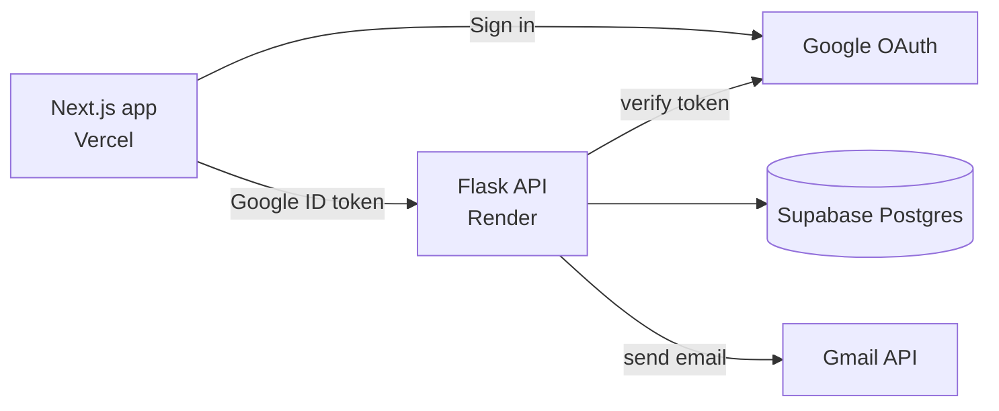

# TaskFlow

A small task manager I built for an internship assignment. You sign in with Google, create tasks, assign them to other people, and everyone gets an email when a task is assigned to them or finished.

Live: https://taskflow-lovat-xi.vercel.app
API: https://taskflow-api-b3k6.onrender.com/health

The API is on Render's free plan, so if nobody has used it for a while the first request can take up to a minute while the server wakes up.

## Stack

- Frontend: Next.js + TypeScript + Tailwind, deployed on Vercel
- Backend: Flask, deployed on Render (gunicorn)
- Database: Supabase (Postgres)
- Login: Google OAuth 2.0
- Emails: Gmail API

## Architecture



The frontend never talks to the database directly. Everything goes through the Flask API.

**Login.** The Google button on the frontend gives back an ID token. The frontend sends it to `POST /auth/google`, Flask checks it with Google's `google-auth` library, creates the user in Supabase if they're new, and returns a JWT. After that the frontend sends the JWT in the `Authorization` header, and protected routes check it with a `login_required` decorator. Tokens expire after 24 hours.

**Emails.** I used the Gmail API instead of SMTP because Render's free tier blocks SMTP ports. One Gmail account is authorized once with only the `gmail.send` scope, and the backend uses its refresh token to send mail. Sending happens in a background thread so the API doesn't wait on Gmail.

- Task created without an assignee: the creator gets a confirmation
- Task assigned or reassigned: the assignee gets an email
- Task completed: the creator gets an email

**Permissions.** Only the person who created a task can assign, reassign or delete it. The creator or the assignee can mark it complete. You only see tasks you created or that were assigned to you.

## Database

Two tables, `users` and `tasks`. A task has a `created_by` and an optional `assigned_to`, both pointing at `users.id`. If a user is deleted, the tasks they created go with them, and tasks assigned to them just become unassigned.

Row Level Security is on for both tables with no public policies, so only the backend (which uses the secret key) can touch the data.

The SQL is in [`/migrations`](./migrations). Run the files in order in the Supabase SQL editor.

## API

```
GET    /health
POST   /auth/google
GET    /auth/me
GET    /users
GET    /tasks?view=all|created|assigned
POST   /tasks
PATCH  /tasks/<id>/assign
PATCH  /tasks/<id>/complete
DELETE /tasks/<id>
```

Everything except `/health` and `/auth/google` needs a JWT.

## Deployment

- Vercel: root directory `frontend`, with `NEXT_PUBLIC_API_URL` and `NEXT_PUBLIC_GOOGLE_CLIENT_ID` set
- Render: root directory `backend`, build `pip install -r requirements.txt`, start `gunicorn run:app --bind 0.0.0.0:$PORT`, and the same variables as `backend/.env.example`
- The Vercel URL needs to be added to the OAuth client's authorized JavaScript origins, and set as `FRONTEND_URL` on Render for CORS
